# Assignment 1 - setup_intro

## Assignment - Research

Checkout the code folder and make sure you can build and understand all examples in the 01_main and 02_types_vars folders. In the 02_types_vars folder, checkout the code for TODO directives. Follow the directions and implement an example in your team. Checkout the scope_exercises.md file and follow the directions there, too.

- Understand all examples in the 01_main and 02_types_vars folders and tried to building up all the given examples

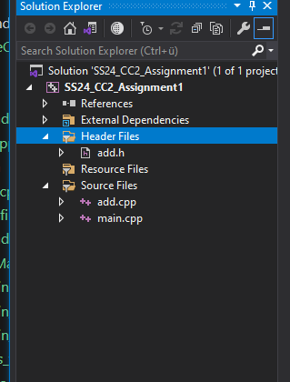 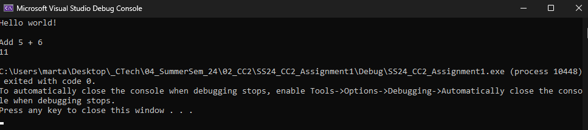 

- From the cpp_tintro.md, I found the following command to run the progamm. It actaully just works with "name-you-want-to-give.exe"
 
         // Run the program
        $ .\<name-you-want-to-give>.exe

  
  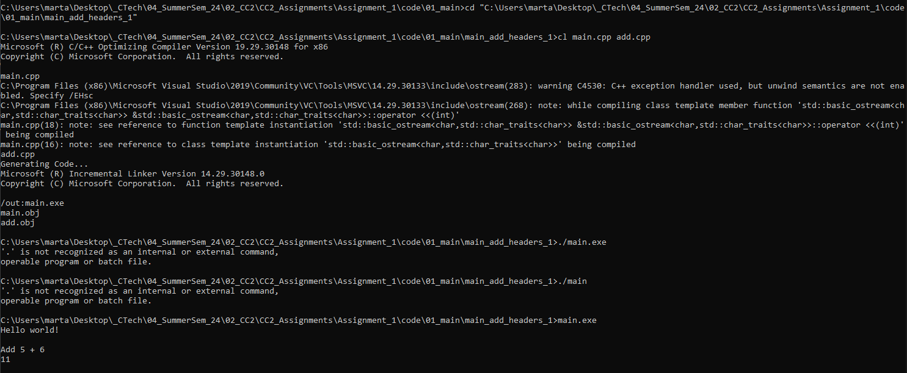

- In folder - main_add_header_2, the add.h is in another folder, adding them directly did not work. -Iinclude needs to be added to make it include everything in the subfolder. 
  
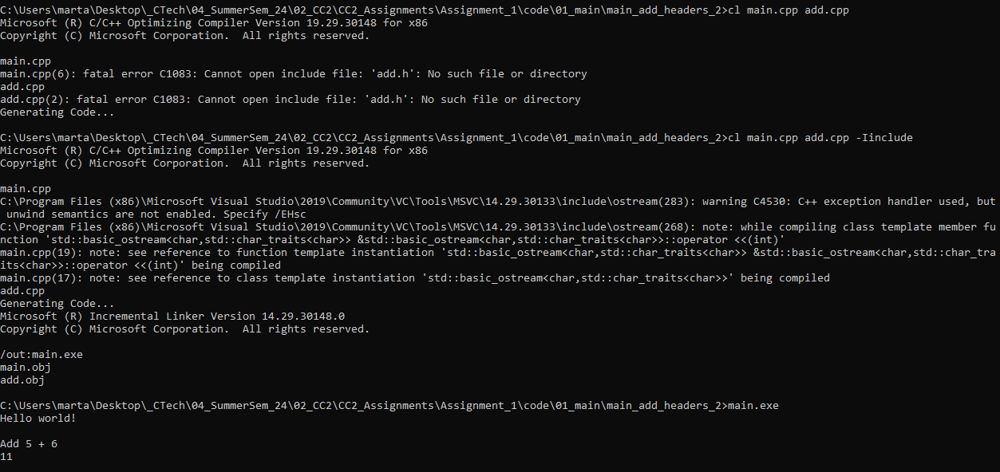

- Running the example in 02_types_vars/scope_exercise. In the outer scope, "a" and "b" are  initially set to 100, and in inner scope, the local variables "a" and "b" are created and set to 200, the result only shows the local variables(200). This demonstrates the concpet of an inner scope shadowing an outer scope.

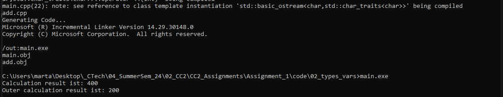

- vector.cpp
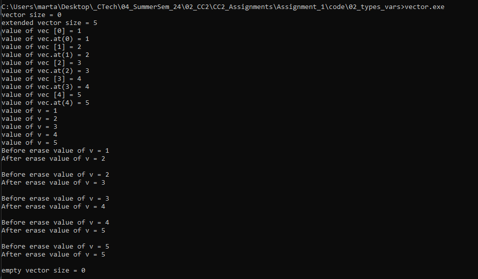

- For storing floating point values and string value, I can define vector as 
  
        std::vector<double>

        std::vector<std::string> 

 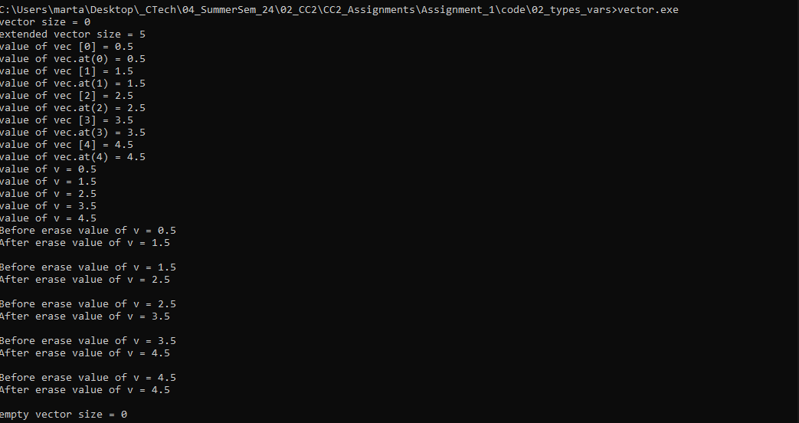
  

## Assignment - Bug fixing
- Please check the folder - 03_errors for the coorected code

## Assignment - Creativity 

- Running the example
  
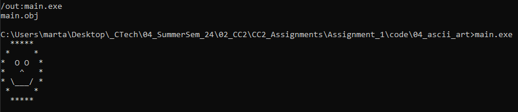

- Adding menu for user to choose different ASCII art.  Here I made a pretty stupid mistake which took me a while to know. The code has no bug and it works good but the choose funtion only works once. If a user wants to choose again, the application has to reopen in order to make the choose function work. 
  
  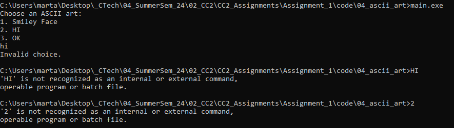 

  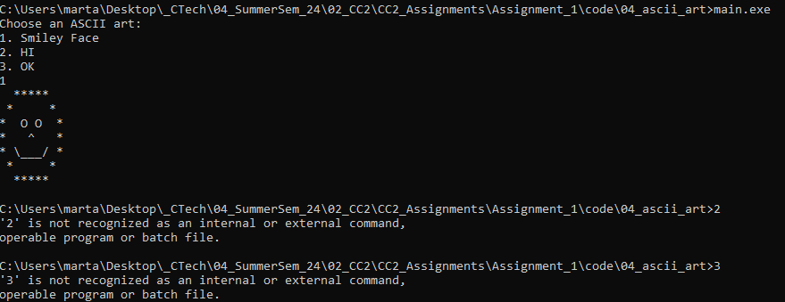
  
  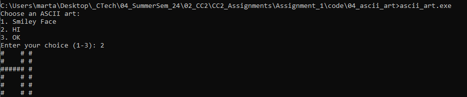

  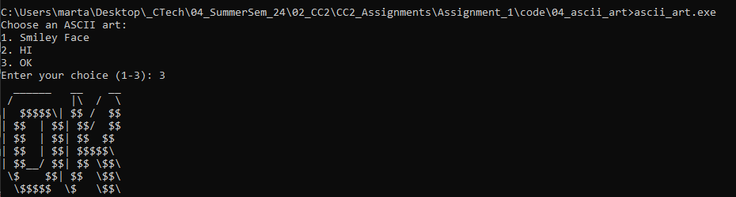