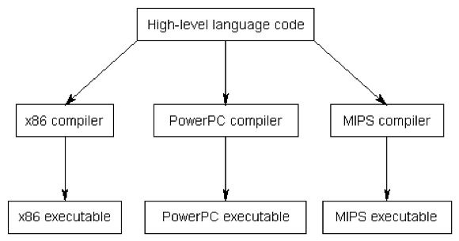
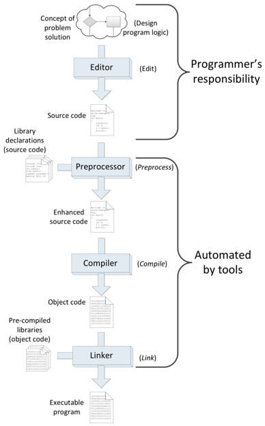

**Creative Coding II**

Prof. Dr.-Ing. Angela Brennecke | a.brennecke@filmuniversitaet.de | Film University Babelsberg *KONRAD WOLF*   
Anna Brauwers | anna.brauwers@filmuniversitaet.de | Film University Babelsberg *KONRAD WOLF*


---


**Table of Contents**
- [C++ Introduction](#c-introduction)
    - [Historical Notes](#historical-notes)
    - [Features](#features)
    - [Challenges](#challenges)
- [The C++ Build Process](#the-c-build-process)
  - [Platform-dependency and Compiled Language](#platform-dependency-and-compiled-language)
  - [Compiler, Linker, Executable](#compiler-linker-executable)
  - [Compiler \& Linker Errors](#compiler--linker-errors)
- [Integrated Development Environments (IDE)](#integrated-development-environments-ide)
- [Practical Exercises](#practical-exercises)
- [Summary](#summary)
- [Reading Material](#reading-material)

---

# C++ Introduction

### Historical Notes

C++ is a **high-level programming language** with a rich set of syntactic and semantic elements that supports multiple programming concepts and paradigms such as object-oriented programming, generic programming, functional programming, and many more. 

In the last 10-15 years, the feature set of C++ has undergone several changes and the language is being improved on a regular level. The latest revision of C++ officially published by the ISO (International Organization for Standardization) working group is C++23 with C++26 being on its way. 

- Find an overview at [ISO Cpp's current status page](https://isocpp.org/std/status). 

 C++ was originally developed in 1979 by [Bjarne Stroustrup](https://www.stroustrup.com) while he was working on his PhD thesis. C++ was then first called "C with Classes" indicating its close connection to the "C"-programming language as well as one of its features, i.e., object-oriented programming. The name "C++" was then officially introduced in the early eighties. Bjarne Stroustrup is still actively developing the language and is part of the Directors and Officers board of the Standard C++ Foundation ([isocpp.org](https://isocpp.org)).

- Find an overview of the history of C++ at [cplusplus.com](https://cplusplus.com/info/history/)
- Find more on the history of C++ at [stungeye's Github](https://stungeye.github.io/Programming-1-Notes/docs/03-history-of-cpp/00-history-of-cpp.html)

### Features

What makes C++ a long-lasting and successful programming language is the support of low-level ( == close to the hardware) as well as a high-level programming (== close to the human) programming at the same time. C++ is particularly well-known for its support of:

- writing very efficient (real-time) software applications
- object-oriented programming
- generic programming
- software design capacities

### Challenges

Of course, there are also several critical voices arguing that C++ is too hard to learn, not state-of-the-art, and carries along too many concepts due to its long history. There is a truth in these arguments. Yet C++ is a widely used language which is evolving frequently. It allows the developer to manipulate mostly everything and thus requires a solid understanding in order not to break things. Beware that it will be challenging to understand C++ concepts, to deal with compiler and linker errors and to be truly responsible for what you are doing. However, it will allow you to develop a deeper understanding of:

- how software and hardware interconnect
- the craft of software development 
- where modern programming concepts come from.

Checkout what [Bjarne Stroustrup](http://stroustrup.com) thinks about
- [five popular myths about C++](https://isocpp.org/blog/2014/12/myths-1).


# The C++ Build Process

## Platform-dependency and Compiled Language

C++ is a **compiled programming language**. This means that the source code the developer is writing has to be translated into machine code before it can actually be executed (in the form of an application) on a computer. The machine code is deployed as a platform-dependent **application binary** or **executable**, i.e.,

- myApp.**app** on macOS 
- myApp.**exe** on Windows. 
 
> - **a.out** on UNIX-like systems, also on MacOS (see e.g. [Wikipedia](https://en.wikipedia.org/wiki/A.out) for further references)

**Platform-dependency** means that the software executable can only be run and executed on the platform it was built on. 
To build an C++ application, several steps are involved which are part of the **build process**: 
- **compiling** and **linking** the source files 
- **building** the application (file extensions *.app on macOS, *.exe on Windows).   

An advantage of the **platform-dependent** or **native development** with C++ is the ability to create applications that can apply the platform's software and hardware components directly. macOS and Apple computers come with different implementations for how to use and connect with the operating system and hardware devices than do Microsoft and Windows computers. The same is true for Linux as well as any of the embedded systems. 

A disadvantage (at least for the newbie developer) might be that the development process requires much more understanding of the individual development steps that are involved. This is usually not needed when working with an interpreted language such as Java, JS, Processing or Python, for instance.

## Compiler, Linker, Executable

The compilation itself is executed by a **compiler** such as, among others, 

- [GNU gcc](https://gcc.gnu.org): Unix-like systems
- [MinGW](https://www.mingw-w64.org): GNU gcc on Windows
- [Clang](https://clang.llvm.org)/[LLVM](https://www.llvm.org): Cross-platform
- [MSVC (MS Visual Studio Compiler)](https://learn.microsoft.com/de-de/cpp/cpp/?view=msvc-170): Classically windows

The compiler analyzes the source code written in C++, enhances and optimizes it and turns it into assembler code which consists of binary numbers and can be directly executed and understood by the machine.

Looking at the different language features of C++, it depends on the compiler version you are applying whether or not you can actually use them. Also, the compiler depends on the specific operating system and development environment you are using and enforces platform-dependent development. See the following illustration for different platform-dependent compilers:



The process of compiling source cocde into machine code is quite complex and involves several additional steps such as pre-processing, creating assembler and object code, linking, and building. Generally, all of this is referred to as the **C++ build process** which is illustrated in the following graphic and which is central to understanding **platform-dependent software development**:

  
*Image credit: Richard L. Halterman (2017): Fundamentals of C++ Programming. Online print.*

**Editing**

- The software developer conceives a solution for a given problem and designs a software with the help of a code editor.
- The developer is responsible for including and adding additional sources and functionality if required, for instance, in the form of  additional APIs.
- When ready, the developer triggers the build process in the IDE.

**Preprocessing**

- The **pre-processer** analyses the source code and evaluates specific preprocessor directives like **#inlcude**. These routines inform the compiler and linker about including additional libraries, for instance, for the APIs our programs will use.
- Based on the evaluation, the source code may be enhanced and modified so that it is prepared for the actual compilation.

**Compilation** 

- The **compiler** translates the enhanced C++ source code into **assembler code** and then into **object code**. Object code is a specific type of machine code (composed of bits) that contains additional meta data required by the linking step.

**Linking**

- The **linker** picks up all object code and pre-compiled library code that is required to build the final application and generates the executable.
- The executable is now written in **native machine code** and can be launched and exectuted by the operating system.

Executables are sets of instructions that tell the computer how to operate. Therefore, the instructions have to be written in the machine code that is understoond by the particular machine / target / platform. Machine code is a very low-level programming language with each instruction set being composed of bits like, for example, `10110000 01100001`. These instruction sets are different per platform and in particular per CPU.

Each platform's operating system comes with a small program called **loader**. When executing the binary, i.e., by double-clicking it, the loader loads the binary file into the platform's random access memory (RAM) and the platform's CPU executes the machine code instructions.

See the [deep dive into compilation](../01_kick-off_setup_cli/additional_material/compilaton.md) for more details.

## Compiler & Linker Errors

During the build process, compiler and linker evaluate the source code, object code and final machine code continuously. If an expression, statement or definition cannot be successfully processed, the build process will stop and a **compile-time error** will be thrown (to prevent any **run-time error** that might appear during program execution). Such an error is usually triggered during the compilation or the linking step of the build process. 

- **Compiler errors** occur during compilation usually refer to syntax errors in the source code. The compiler provides **compiler error code** which is usually very helpful to identify and fix the compiler error. Nonetheless, it takes a while until you will get used to reading it.

- **Linker errors** occur during linking of the object files and are often much harder to fix. These types of errors usually occur when certain implementation details are missing during linking. Again, the linker provides **linker error code** but it will take a while to get familiar with it. Most prominent issues are
  - A function has only been declared, not defined,
  - A source file is missing or cannot be found,
  - An additional library has been linked but cannot be found by the linker (i.e., because the folder structure has changed or the library has been removed).


# Integrated Development Environments (IDE)

C++ applications can be build manually on the command line by adding all commands to successfully compile, link and build the executable. However, the larger the project gets the more complex the information becomes that the developer needs to specify. **Makefiles** have been introduced to collect and provide all the information required for the build process in one file. By calling the `make` command on the command line, the Makefile is evaluated and the build process is triggered.

Even more sophisticated is the use of an integrated development environment, an IDE. Central features of an IDE are:
1. A **text editor** usually with syntax highlighting and IntelliSense.
2. A **debugger** to step through the code during runtime and in order to identify mistakes and bugs.
3. A **build environment** that processes, compiles, and links the source code.

 C++ applications and in particular openFrameworks applications can be build with [several IDEs](https://openframeworks.cc/download/), some of them are platform-dependent, i.e., they will execute on one platform only such as **XCode** on macOS or **MS Visual Studio** on Windows. Some of them are cross-platform, i.e., they will execute on multiple platforms (i.e. Qt Creator). In both cases, the IDE will build a platform-dependent or native application. This application will run on a macOS computer if it was build there but will not run on a Windows computer and vice versa. 

Platform-dependent IDEs are usually optimized for a specific platform whereas cross-platform IDEs require additional configuration settings in order to build applications for a specific platform. In an IDE, the **target** specifies and refers to the platform for which the compilation is going to generate machine code for. A target thus can be MacOS, Windows, iOS, Android, etc. Sometimes the target is used for the type of executable, i.e. *exe, *.app, etc.


Each major IDE uses a particular type of **project file** (similar to the **Makefile**), i.e. 

- MS Visual Studio uses ***.sln**, 
- Xcode uses ***.xcodeproj**

to keep track of all 

- sources files, 
- required header files, 
- additional library files and 
- compiler, linker, and builder parameter settings.

In contrast to IDEs such as Xcode or MS Visual Studio, **MS Visual Studio Code** (VS Code) circumvents a specific project file and instead uses several files and the C++ extensions to keep track of the above. In VS Code,

- the ***.code-workspace** file is used to track the source files
- the **.vscode** folder (that appears within every folder that tracks *.cpp files) introduces 
  - **c_cpp_properties.json** to take care of file pathes to sources files, include files, library files, etc.
  - **launch.json** to take care of debugger settings
  - **tasks.json** to take care of compiler and build settings

See the [Setup Guide](./setup_guide.md) for more details.


# Practical Exercises 

We will look into 

- the main.cpp file
- building and executing the first C++ application on the command line
- building and executing the first C++ applications in an IDE

To run your first program on the command line, here are the build commands

```c++

// Open the command line (**terminal** on MacOS or **cmd** on 
// Windows) and move to the folder where your code resides.
$ cd '/your/c++/dev/folder/path/' 

// Now, compile the sources code on macOS
// g++ or clang++ is the compiler you are using
$ g++ -o <name-you-want-to-give> main.cpp 

// Now, compile the sources code on windows
// g++ or clang++ is the compiler you are using
$ g++ -o <name-you-want-to-give>.exe main.cpp

// Finally, run the program
$ ./myprogram

````


# Summary

- C++ is a high-level programming language
- C++ is also a compiled programming language that requires the developer to translate source code into an executable
- The translation of source code into an executable is referred to as build process 
- C++ development requires to take into account the specifics of a particular platform
- Command line development requires developers to manually execute the build process 
- Integrated development environments help to organize the development process and are relevant for larger projects


---

# Reading Material

- [C++ Language Introduction](https://cplusplus.com/doc/tutorial/)
- [C++ basics](https://openframeworks.cc/ofBook/chapters/cplusplus_basics.html) 
- [Learncpp learning material (recommended resource!)](http://www.learncpp.com)
  - and [the C++ build process](https://www.learncpp.com/cpp-tutorial/introduction-to-the-compiler-linker-and-libraries/)
- [Introduction to C++](https://stungeye.github.io/Programming-1-Notes/docs/05-introduction-to-cpp/00-introduction-to-cpp.html)
  - and [the C++ build process](https://stungeye.github.io/Programming-1-Notes/docs/05-introduction-to-cpp/02-the-build-process.html)

**Advanced:** 

- The [Compiler Explorer](https://gcc.godbolt.org) to play with different compilers
- Michael Witt's [deep dive into compilation](../01_kick-off_setup_cli/additional_material/compilaton.md) (advanced!)
