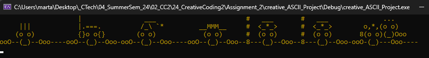

# Assignment 2 - syntax_basics

## Ascii Art Exercises

### Exercise 1

- Compiling the six different source code files in the ascii art folder
  
   
   
    
   

### Exercise 2 + Exercise 3

- Please check the folder - finished_ASCII_project for the completed application where all the funtions, structure, ascii.cpp ascii.h are added and rearranged for readability

### Exercise 4 / Homework Assignment

- I worked on this alone because I missed the first few lesson. I tried to keep it simple and focus on getting familiar with the coding environment. After checking some new syntax, I decided to add a new option for a colorful ASCI art, not too complicated yet get to learn new syntax. When user chooses option 3(colorful ASCII art) ,  the ACII art will loop through 4 colors for a period of time. The completed code please check folder - creative_ASCII_Project.

 
 
 
