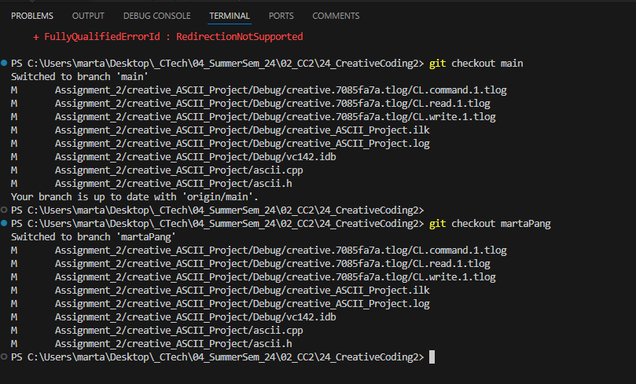
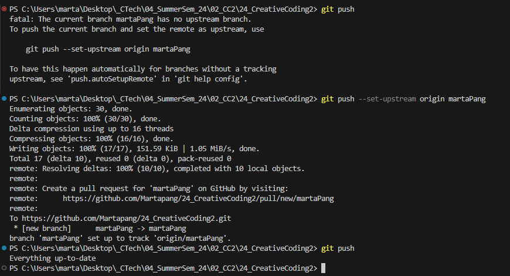
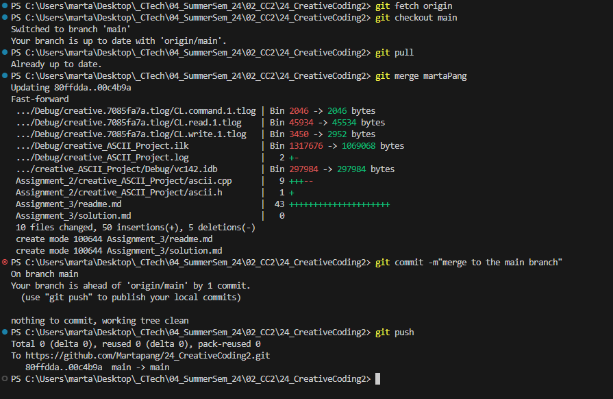

# Assignment 3 - syntax_basics_ctd

### 1 Assignment - Github Development 
     In your teams, create a developer branch for each developer. In order to work on the developer branch you have to call git checkout <branch-name>. Develop your feature for the ascii art application and push it to your developer branches. In order to merge the developer features to the main branch, make sure to follow this procedure
- I worked on this assignment alone, in order to get myself familiar with the concept of branching, I walked myself through the steps creating a new brunch and merging back to the main branch. 

 
 

### 2 Assignment - Creativity

In your team, continue to develop a creative and fun to use ascii_art application. Base it on your learnings so far and use the application exercises as a basis for new ideas. 

- How should the application work? 
- What components will be part of it (UI, reading, writing, printing, ascii-art)? 
- How can you create an animated ascii art in the command line? 

Think about how to use a data type like a `struct` (or `class`) in your application. Document your application design with a few bullet points and implement a solution.

- I did the assignment alone.  I wanted keep th application easy and focus on learning new syntax. Most of the features from the last developments like menu, animated ASCII art and the color change will be kept. In this part, I want to add one more option to display random ASCII art files and play random music.

- At the end, it was not as simple as I expected. Getting the music work was a hustle. I added a debug message to make sure the playMusic funtione is corrected implemented. It also shows on the console the msuic is playing but no sound on my laptop.  Debugged with Cahtgpt that I have to add "do {} while (condition) loop " to repeatedly execute it, after that I can hear it. 

- Also the amount of headers need to be added to main.cpp and ascii.cpp stll confuses me. Maye it will get better the more I code. 
  
- Video: https://youtu.be/98p9bLeou0M