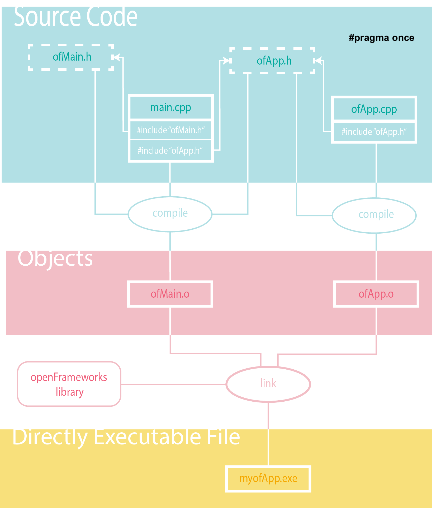

**Creative Coding II**

Prof. Dr.-Ing. Angela Brennecke | a.brennecke@filmuniversitaet.de | Film University Babelsberg *KONRAD WOLF*   
Anna Brauwers | anna.s.brauwers@filmuniversitaet.de | Film University Babelsberg *KONRAD WOLF*

---

**Table of Contents**
1. [What is openFrameworks?](#what-is-openframeworks)
   1. [Contributions and Uses](#contributions-and-uses)
   2. [openFrameworks and Processing](#openframeworks-and-processing)
2. [openFrameworks SDK](#openframeworks-sdk)
   1. [openFrameworks Folder structure](#openframeworks-folder-structure)
      1. [addons](#addons)
      2. [apps](#apps)
      3. [docs](#docs)
      4. [examples](#examples)
      5. [libs](#libs)
      6. [other](#other)
      7. [projectGenerator](#projectgenerator)
      8. [scripts](#scripts)
3. [The ofApp](#the-ofapp)
4. [Reading Material](#reading-material)

---

# What is openFrameworks?

[openFrameworks](https://openframeworks.cc) is free, open source C++ software development kit (SDK) that takes a development approach similar to the [Processing](https://processing.org) environment. Interestingly, both toolkits [originate from the Massachusetts Institute of Technology (MIT)](https://openframeworks.cc/ofBook/chapters/foreword.html). 

The openFrameworks SDK targets easy development of **real-time** and **close-to-the-hardware applications** and is primarily designed for use in creative and experimental projects. It is cross-platform and supports systems such as OS X, Windows, Linux, iOS, Android & Linux ARM devices such as Raspberry Pi. Refer to the [official website](https://openframeworks.cc) for more information.

## Contributions and Uses

Even though many different people have contributed to the open source SDK openFrameworks, digital media artist [Zach Lieberman](http://zach.li) still stands out as a central initiator and contributor to the development and who still uses openFrameworks for his artistic sketches that he publishes on Instagram on a regular basis:

See also these code, tutorials, and artists or project pages (not very diverse though ... help find / introduce female openFrameworks' artist!)
- https://github.com/openframeworks
- https://www.youtube.com/@danbuzzo
- https://www.youtube.com/@lewislepton
- https://theowatson.com/work/eyewriter
- https://theowatson.com/work/audio-space
- http://thesystemis.com
- https://junkiyoshi.com

## openFrameworks and Processing

openFrameworks does not come with an integrated development environment (IDE) right away like, for instance, Processing does. Instead, openFrameworks comes with a set of **C++ source files** (comprised of header *.h and definition *.cpp files) and system-dependent **pre-compiled libraries** (file extensions *.a on macOS, *.lib on Windows) among other files. These have to be processed as part of a compilation and build process which results in an  openFrameworks application. The resulting application **binary or executable** can be launched by the operating system (OS) as a standalone application and runs independently from the development environment. 

Processing, in contrast, is implemented in Java and thus builds on the Java Virtual Machine. Consequently the resulting application sketch requires the Processing IDE for launching and running the sketch. This can be more convenient in many cases but has its limitations when it comes to real-time applications and time consuming computations in general. Since recently Processing sketches can be exported as standalone applications, too. 

# openFrameworks SDK

The following illustration is placed here for you to recap the different abstraction layers of software components that are involved in the software development process and to recap where openFrameworks fits in (discussed in class):

## openFrameworks Folder structure

The openFrameworks SDK basically unfolds inside several subfolders that contain source files and information required to build the applications properaly. We will examine the folder structure during class closely: 

It is **important** to note though that any change to the folder structure will effect the build process. Therefore openFrameworks comes with a small helper tool, the **projecGenerator** that is intended to generate or update the required IDE project files.

### addons

openFrameworks is highly extensible and provides a dedicated mechanism to involve additional functionality through the use of [ofxAddons](https://ofxaddons.com/categories). These are usually open source and add specific or custom functionality to the SDK. Addons are generally built and maintained by members of the openFrameworks community. The downside here is that not all of the addons are maintained continuously. Hence, several addons are outdated and no longer compatible with the latest openFrameworks version. Once you understand how C++ and openFrameworks work, you can workaround this and update an outdated ofxAddon yourselves ;-)

### apps

The default location for your custom built apps. This can be changed but needs to be taken care of with the help of the projectGenerator to keep the folder structure updated in the IDE's project files.

### docs

This folder containts documentation files.

### examples

This folder contains a lot of example applications that can be built out of the box. It is important to understand that you have to build the example applications with the help of the IDE. To do so, **double-click the project files** which will in turn launch the corresponding IDE:

- *.**xcodeproject** for XCode  
- *.**sln** for Visual Studio

### libs 

This folder contains external pre-built libraries that bring additional functionality to openFrameworks.

### other

This folder contains some internal files for serial tests.

### projectGenerator

The openFrameworks **ProjectGenerator** is a standalone application that comes with the SDK. Its main purpose is:

- to automatically create new project files for your IDE,
- to update existing project files with the current folder structure,
- to include available addons to the project files.

The role of the projectGenerator in the openFrameworks universe is quite central because it helps you keep the IDE's project files up to date with the current folder structure. The IDE's project files contain all of the necessary information required to build an application. They heavily rely on the openFrameworks folder structure because they search the folders for all of the necessary files and information required to compile, link, and build the application. 

`Any change to the folder structure should therefore be considered carefully as it might break the build process.`

### scripts

This folder contains certain scripts required, for instance, for the projectGenerator, to build the examples, or various templates. For example, you can find template files that illustrate how to specify different OpenGL versions.

# The ofApp

The ofApp is the default application class of openFrameworks that provides you with all of the necessary functionality to create and build an openFrameworks application binary. In this next screencast, we will develop a first custom ofApp application and take a closer look at the different aspects of the ofApp class. By default, an ofApp is comprised of three files:

- main.cpp - This file contains the C++ main() function
- ofApp.h - The header file that stores the software interface of an ofApp
- ofApp.cpp - The definition file that stores the implementation details of an ofApp

The following illustration outlines how the different source files required to build an ofApp depend on each other. Read from top to bottom to additionally follow the different steps of the build process:

  
*Copyright by Franziska Pätzold*

Please see the [slides on openFrameworks](./additional_material/cc2_03_ofx.pdf) for more information about the SDK.

---

# Reading Material

- [ofBook: openFrameworks folder structure](https://openframeworks.cc/ofBook/chapters/setup_and_project_structure.html)
- [ofBook: openFrameworks Functions: setup, update, and draw](https://openframeworks.cc/ofBook/chapters/how_of_works.html)

