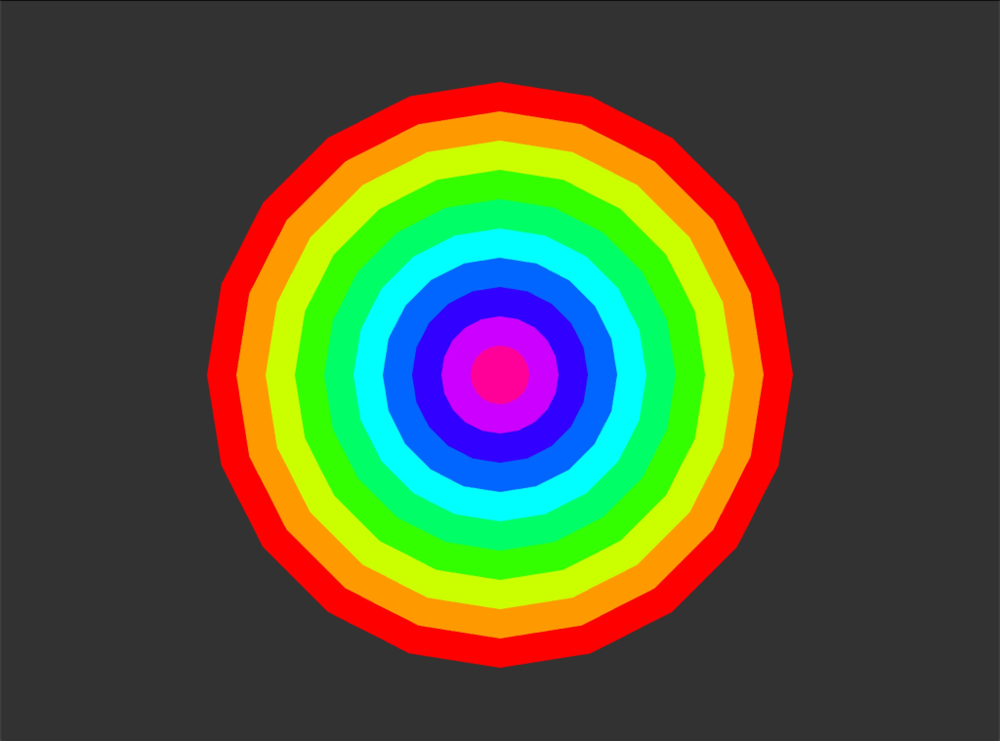

<!-- ---  
title: Creative Coding II
author: Anna Brauwers
affiliation: Film University Babelsberg KONRAD WOLF
date: Summer term 24
---   -->

# Visual Exercise - Basic Shapes, Colors & Interactivity

In these exercises you will re-create visual compositions using basic shapes and colors, using variables and the mouse position to create movement. The goal is to get familiar with the basic syntax and functionality of OpenFrameworks.

Recreate these compositions or follow the instructions using OpenFrameworks.
Each exercise has a set of hints, you can optionally use to help you solve the task.

### Exercise 1


<details>
use ofCircle to create a circle

```cpp
ofCircle(x, y, radius);
```
<summary>first hint</summary>
<details>
use a for loop to repeat the circle

```cpp
for(int i = 0; i < 10; i++){
    ofCircle(x, y, radius);
}
```
<summary>second hint</summary>
<details>
use ofSetColor to change the fill of the circle

```cpp
ofSetColor(255, 0, 0);
```
<summary>third hint</summary>
</details>
</details>
</details>

### Exercise 2
1. Create a rectangle.
2. Make the rectangle change it's size through the mouse position.
3. Change the color of the rectangle when the mouse is pressed.

<details>
use ofMouseX and ofMouseY to get the mouse position

```cpp
ofGetMouseX();
ofGetMouseY();
```

<summary>first hint</summary>
<details>
mousePressed is used to check if the mouse is pressed

```cpp
void ofApp::mousePressed(int x, int y, int button){

}
```

<summary>second hint</summary>
</details>
</details>

### Exercise 3


<details>
you can use ofBackgroundGradient to create a gradient background

```cpp
ofBackgroundGradient(ofColor(255), ofColor(0), OF_GRADIENT_LINEAR);
```
<summary>first hint</summary>
<details>
use ofDist to calculate the distance between two points

```cpp
ofDist(x1, y1, x2, y2);
```
<summary>second hint</summary>

<details>
use ofMap to map values from one range to another

```cpp
ofMap(value, start1, stop1, start2, stop2);
```

<summary>fourth hint</summary>
<details>
use the mapped value "s" to change the size of the rectangles

```cpp
ofRect(x, y, s, s);
```

<summary>fifths hint</summary>
</details>
</details>
</details>
</details>


### Exercise 4

Create your own composition using basic shapes and colors. Think about how you can use repetition, variation, and color to create an interesting composition.
