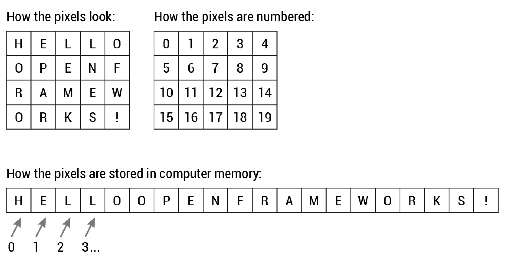

**Creative Coding II**

Prof. Dr.-Ing. Angela Brennecke | a.brennecke@filmuniversitaet.de | Film University Babelsberg *KONRAD WOLF*   
Co-Author: Gastprof. Dr. Michael Witt | m.witt@filmuniversitaet.de
Anna Brauwers | anna.s.brauwers@filmuniversitaet.de | Film University Babelsberg *KONRAD WOLF*

---

**Table of Contents**
1. [Rendering in openFrameworks](#rendering-in-openframeworks)
   1. [Coordinate System](#coordinate-system)
   2. [Rendering Concept](#rendering-concept)
   3. [Drawing in openFrameworks](#drawing-in-openframeworks)
      1. [Drawing and State System](#drawing-and-state-system)
      2. [State Functions in openFrameworks](#state-functions-in-openframeworks)
      3. [Drawing Functions in openFrameworks](#drawing-functions-in-openframeworks)
   4. [Graphics and Images Objects in openFrameworks](#graphics-and-images-objects-in-openframeworks)
      1. [ofImage](#ofimage)
      2. [ofPixel](#ofpixel)
      3. [ofTexture](#oftexture)
      4. [ofFbo](#offbo)
2. [Reading Material](#reading-material)

---

<!-- # Learning Objectives

- Getting an overview of openFrameworks
- Understanding the ProjectGenerator / IDE project file use
- Building and modfying a first openFrameworks app -->


# Rendering in openFrameworks

If we work in 2D- or 3D-space might seem to be fundamentally different. However with openFrameworks these differences are kept away from us and we only notice the switch between 2D- and 3D- space by the need to specify an additional coordinate if we position an object. In 2D-space we always specify `x` and `y` or a two-dimensional vector (`glm::vec2`) whereas in In 2D-space we specify `x`, `y` and `z` or a three-dimensional vector (`glm::vec3`). OpenFramework defines powerful datatypes for these purposes.

## Coordinate System

First thing to make up your mind when working with a visualisation library is to look at the coordinate system. Where is the the origin in the cartesian coordinate system located in our window? In which direction does the **X**, **Y** and **Z** axix grow:

```c++
int main( ){    
	ofSetupOpenGL(1279, 719, OF_WINDOW);
   ofRunApp(new ofApp());
}
```


OpenFrameworks builds its **2D** coordinate system by default in the following way:
- The **origin in the cartesian coordinate system** is located in the top left corner of your window
- The **X**-axis grows from left to right
- The **Y**-axis grows from top to bottom
- The **Z**-axis grows from the monitor towards you

There are functions in openFrameworks to manipulate the coordinate system:

- [ofTranslate](https://openframeworks.cc/documentation/graphics/ofGraphics/#show_ofTranslate) moves the coordinate origin
- [ofRotateDeg](https://openframeworks.cc/documentation/graphics/ofGraphics/#show_ofRotateDeg), [ofRotateRad](https://openframeworks.cc/documentation/graphics/ofGraphics/#show_ofRotateRad), [ofRotateXRad](https://openframeworks.cc/documentation/graphics/ofGraphics/#show_ofRotateXDeg), [ofRotateXRad](https://openframeworks.cc/documentation/graphics/ofGraphics/#show_ofRotateXDeg), [ofRotateYRad](https://openframeworks.cc/documentation/graphics/ofGraphics/#show_ofRotateYDeg), [ofRotateYRad](https://openframeworks.cc/documentation/graphics/ofGraphics/#show_ofRotateYDeg), [ofRotateZRad](https://openframeworks.cc/documentation/graphics/ofGraphics/#show_ofRotateZDeg), [ofRotateZRad](https://openframeworks.cc/documentation/graphics/ofGraphics/#show_ofRotateXDeg) rotate tge coordinate system
- [ofScale](https://openframeworks.cc/documentation/graphics/ofGraphics/#show_ofScale) scales the axis of the coordinate system by the given factors

## Rendering Concept

In openFrameworks, the separation between general (or CPU-based) calculations, special graphics (or GPU-based) calculations, and all calculations that refer to user input (CPU-based) has been mapped to different functions in ofApp class, respectively:

- **update**() function dedicated to any general calculation
- **draw**() function dedicated to graphics based calculations
- **keyboard** and **mouse input** functions dedicated to user input calculations.

All of them are continuously evaluated and executed by the underlying openFrameworks SDK at a specified frame rate. In particular, draw() function is intended on a design level to aggregate any calculation related to graphics processing and to transfer all of them to the underlying rendering unit that is based on OpenGL.

**Please** [refer to this link on 3D graphics with OpenGL ](https://www3.ntu.edu.sg/home/ehchua/programming/opengl/CG_BasicsTheory.html) and read chapter 1 on computer graphics hardware if you need more details on the following aspects:

- pixels and frame 
- frame buffer and refresh rate (and _frame rate_)
- double buffering an VSync

In the following sections, we will explore the classes and functions povided by openFrameworks to work with images, pixels, and frames. In this context, it can be helpful to understand the functions
- [ofSetFrameRate](https://openframeworks.cc/documentation/application/ofAppRunner/#!show_ofSetFrameRate)
- [ofSetVerticalSync](https://openframeworks.cc/documentation/application/ofAppRunner/#!show_ofSetVerticalSync)

and how they are related. Both allow you to adjust the respective parameters. Note that vertical sync depends on the actual refresh rate provided by the output device, i.e., the monitor.

## Drawing in openFrameworks

### Drawing and State System 

Drawing is a complex process that involves a lot of parameters to describe the kind of shape you want to draw on the screen. Imaging drawing a simple box. The location of the box is described by it's coordinates in the 2D- or 3D-space. furthermore you need to specify width, height and depth of the box. You also want to specify a color. Maybe the width of the outline of the box and its color. 

All these things are valid parameters that needs to be considered for drawing. One could write a function that takes all these parameters as arguments. However that would result in functions with very long signatures causing a lot of memory copy actions when calling the function. Instead of doing so openFramework incorporates a **state system** where the configuration like color, line width, background color etc. is stores as state inside the open frameworks runtime and are always read when something should be drawn. 

### State Functions in openFrameworks

OpenFramework now provides you with function to manipulate this state `ofSet*` and read the state `ofGet*`:

- `ofSetBackgroundAuto` / `ofGetBackgroundAuto` - Sets the background clearing function to be auto (default) or not. If non-auto, then background clearing will not occur per frame (at the start of draw) but rather, whenever ofBackground is called.

- `ofSetBackgroundColor` / `ofGetBackgroundColor` - Sets the background color. It takes as input r,g,b (0-255). The background is cleared automatically, just before the draw() command, so if the background color is not changing, you could call this inside of setup() (once, at the start of the application). If the background color is changing, you can call this inside of update().

- `ofSetBackgroundColorHex` / `ofGetBackgroundColorHex` - Sets the background color using a hex color value.


- `ofSetCircleResolution` / `ofGetCircleResolution` - Sets the resolution for the ofDrawCircle command. By default, the circle is 22 points, but if you need to draw larger circles, you can adjust the resolution using this command. all circles are cached in opengl using a display list for optimization purposes.
- `ofSetColor` / `ofGetColor` - Sets the draw color with r,g,b, passed in as a hex. Hex is a conventient way to write colors. Some examples:


- `ofSetCoordHandedness` / `ofGetCoordHandedness` - Switch the handedness of the coordinate system
- `ofSetCurveResolution` / `ofGetCurveResolution` - Manipulate the resolution when rendering curves
- `ofSetDepthTest` / `ofGetDepthTest` - Set depth testing on or off to either sort by z-depth (true) or draw order (false).
- `ofSetDrawBitmapMode` / `ofGetDrawBitmapMode` - Set the bitmap drawing mode

- `ofSetHexColor` / `ofGetHexColor` - Sets the draw color with a hex value.

- `ofSetLineWidth` / `ofGetLineWidth` - ofSetLineWidth sets the width of the ofDrawLines called after.

- `ofSetPolyMode` / `ofGetPolyMode` - Sets the drawing behavior for overlapping parts of the same polygon.

- `ofSetRectMode` / `ofGetRectMode` - Sets the mode for drawing rectangles and other rectangular objects, if they are corner aligned, or drawn so that the x,y position is the center of the rectangle. possible options are OF_RECTMODE_CENTER and OF_RECTMODE_CORNER. This affects not only how ofDrawRectangle() objects are drawn, but also ofTexture (and therefore ofImage) objects.

- `ofSetStyle` / `ofGetStyle` - We use ofSetStyle to set the current style of the ofGraphics. Parameter style contains information of the graphics style such as ofColor, ofFill, polyMode and others. See ofStyle for more details.

- `ofPushStyle` / `ofPopStyle` - Save the current style setup / restore the last style setup

### Drawing Functions in openFrameworks

So we now know about the state that is used when we draw on the screen. To perform the actual drawing openFrameworks provides us with several `ofDraw*` functions for all kinds of 2D- and 3D-shapes:

**2D shapes**
- `ofDrawBezier`
- `ofDrawBitmapString`
- `ofDrawBitmapStringHighlight`
- `ofDrawCircle`
- `ofDrawCurve`
- `ofDrawEllipse`
- `ofDrawLine`
- `ofDrawRectRounded`
- `ofDrawRectangle`
- `ofDrawTriangle`

**3D shapes**
- `ofDrawBox`
- `ofDrawCone`
- `ofDrawCylinder`
- `ofDrawIcoSphere`
- `ofDrawPlane`
- `ofDrawSphere`

By combining the manipulation of state and using the drawing functions we can create interesting drawings.

```cpp
void ofApp::draw() {
    ofSetColor(255, 0, 0);
    ofDrawCircle(100, 100, 50);

    ofSetColor(0, 255, 0);
    ofDrawCircle(100, 200, 50);

    ofSetColor(0, 0, 255);
    ofDrawCircle(100, 300, 50);
}
```

## Graphics and Images Objects in openFrameworks


In openFrameworks, several classes have been introduced that deal with image processing (see also [Varieties of oF Image Containers](https://openframeworks.cc/documentation/application/ofAppRunner/#!show_ofSetVerticalSync)). Most importantly, the following four classes represent the different aspects of image handling and graphics processing at different abstraction levels: 

- [**ofImage**](https://openframeworks.cc/documentation/graphics/ofImage/) - this is a high level class that offers easy-to-use access to image handling and manipulation
- [**ofPixels**](https://openframeworks.cc/documentation/graphics/ofPixels/) - this is a class that represents images at pixel level and provides additional functionality for image processing at pixel level; ofPixel operations are CPU-based
- [**ofTexture**](https://openframeworks.cc/documentation/gl/ofTexture/) - this is a class that represents images at texture level and provides additional functionality for graphics rendering; ofTexture operations are GPU-based
- [**ofFbo**](https://openframeworks.cc/documentation/gl/ofFbo/) - this class represents a frame buffer object, i.e., an additional frame buffer for storing computer generated renderings; ofFbo can be used for off-screen drawings 

### ofImage

The **ofImage** class is a high-level representation of common image processing functionality on a computer. It contains both an **ofPixel** object as well as an **ofTexture** object. According to [ofBook's chapter on Image Processing and Computer Vision](https://openframeworks.cc/ofBook/chapters/image_processing_computer_vision.html#preliminariestoimageprocessing)

> The ofImage is the most common object for loading, saving and displaying static images in openFrameworks. Loading a file into the ofImage **allocates an internal ofPixels object** to store the image data. ofImage objects are not merely containers, but also include internal methods and objects (such as an ofTexture) for displaying their pixel data to the screen.

Hence, the ofImage is designed such that it allows to represent both,  easy acces to CPU-based as well as GPU-based images and graphics operations on pixel and on texture level. The following diagram depicts how ofImage, ofPixels and ofTexture are related:


*Image source: https://openframeworks.cc/ofBook/chapters/image_processing_computer_vision.html*


The ofImage class is discussed in further detail in the book **Mastering openFrameworks** with a focus on ofPixels and ofTexture [DPere2013, Chapter 4, pp. 105]:

> The architecture of a computer assumes all images, vector graphics, and 3D objects that will be depicted on the screen should be loaded at first into the video memory. Images in the video memory are called textures. By default, openFrameworks's class ofImage holds two same images. These are the pixel array in RAM that can be accessed by image.getPixels() and its clone, the texture in the video memory that can be accessed by image.getTextureReference().
> 
> So, when you change the pixel array of image, you need to call image.update() in order to apply the changes to the corresponding texture. 
> 
> You may ask why is such a double representation needed? Yes, indeed, it is possible to discard the texture (using the image.setUseTexture( false ) function) and to render the pixel array directly on the screen. But this operation needs to load the pixel array into the video memory anyway, which is a fast but nevertheless time-consuming operation. So, if we did not change the image or wish to draw it several times on the screen, it is better to have a texture for it.
> 
> You can discard a pixel array too. Pixel arrays are just tools for writing images to disks and a convenient way of changing it using CPUs. So, if you do not want to change your image, it is good idea to use only textures, without having pixel arrays in the RAM. To do so, use ofTexture instead of ofImage. In case you are using ofTexture, your image will lie in the video memory only and will not occupy any RAM. So you obtain memory optimization, which is crucial for large projects.

ofPixels and ofTexture go hand in hand when it comes to creating, manipulating and displaying images, as can be seen in the following code example:

```cpp
// Taken from
// https://openframeworks.cc/documentation/graphics/ofPixels/

ofTexture tex;
// do some stuff with t
ofPixels pix;
tex.readToPixels(pix); // now all the pixels from tex are in pix
```


In order to keep both objects and the corresponding image data they store in sync, keep in mind to always call the [ofImage update()](https://openframeworks.cc/documentation/graphics/ofImage/#show_update) function after any operation on ofPixels or ofTexture.


### ofPixel

In [Creative Coding 1](https://github.com/ctechfilmuniversity/ws1920_cc1), you learned about how pixel data is usually stored internally, i.e., in the form of a 1D array. In its most common form, this array is a data structure that represents 8-bit grayscale images or 24-bit color images (8-bit per RGB-channel). If you are lacking background knowledge on the different image formats and representations, review the section [Preliminaries on Image Processing](https://openframeworks.cc/ofBook/chapters/image_processing_computer_vision.html#preliminariestoimageprocessing) from the ofBook. There you will also find an [illustration on how 24-bit color images](https://openframeworks.cc/ofBook/images/image_processing_computer_vision/images/interleaved_1.png) are stored in interleaved form in a 1D array.

Internally, ofPixels also supports this form of storing pixel data.
Graphically, the relationship between pixel color value and array is outlined in the following illustration: 


*Image source: https://openframeworks.cc/ofBook/chapters/image_processing_computer_vision.html*

As you can see, the top left matrix represents the final image depicted as a pixel matrix. The top right matrix represents the corresponding array indices that allow you to access the individual color values per pixel. Finally, on the bottom of the illustration the actually pixel array is being displayed. In code, you might use an object of type ofPixels as follows to manipulate individual pixel values:

```cpp
// Taken from 
// https://openframeworks.cc/documentation/graphics/ofPixels/

ofPixels pix;
// put some stuff in the pixels
int i = 0;
while( i < pix.size()) {

    // the char data type can hold variables ranging 
    // from 0-255 and thus fits perfectly when dealing 
    // with color values;
    // the "[ ]" brackets are used to access the color 
    // value that is stored in the pixel pointer at 
    // position or index "i"
    char c = pix[i]; 
    i++;
}
```

In order to get a deeper understanding of how arrays can be used in C++, please refer to [Chapter P of learncpp.com](https://www.learncpp.com). 

### ofTexture

Textures are usually used in the context of computer generated graphics when 3D objects are connected - or bound - to a texture object in order to raise the visual realism or simply bind an image object to a 3D object. ofTexture represents all of the related operations on GPU level in openFrameworks. 

In the ofBook, information on texture objects can be found in the above mentioned section on [ofBook, Preliminaries on Image Processing](https://openframeworks.cc/ofBook/chapters/image_processing_computer_vision.html#preliminariestoimageprocessing): 

>  This container stores image data in the texture memory of your computer's graphics card (GPU). Many other classes, including ofImage, ofxCvImage, ofVideoPlayer, ofVideoGrabber, ofFbo, and ofKinect, maintain an internal ofTexture object to render their data to the screen.

Additionall, there is more information available on the functionality and use of ofTexture in the section on [Textures](https://openframeworks.cc/ofBook/chapters/openGL.html#textures) the Graphics chapter, in particular:

> [...] a texture is a block of pixels on your GPU. That's different and importantly different, than a block of pixels stored on your CPU (i.e. in your OF application). You can't loop over the pixels in a texture because it's stored on the GPU, which is not where your program runs but you can loop over the pixels in an ofPixels object because those are stored on the CPU, which is where your OF application runs. OF has two ways of talking about bitmap data: ofPixels, stored on your CPU and ofTexture, stored on your GPU. An ofImage has both of these, which is why you can mess with the pixels and draw it to the screen.
> 
> There are three important characteristics of a texture, each of the defining part of those constraints: the texture type, texture size, and the image format used for images in the texture. The texture type defines the arrangement of images within the texture. The size defines the size of the images in the texture. And the image format defines the format that all of these images share.

**Please** read the remaineder of that section if you would like to learn more about how to use textures in particular in connection with shaders and 3D objects.

### ofFbo

Finally, the ofFbo class represents a frame buffer object. To better understand the frame buffer object, let us briefly revisit the rendering pipeline as depicted in the following illustration:


_Image source: https://www3.ntu.edu.sg/home/ehchua/programming/opengl/CG_BasicsTheory.html_

The frame buffer is the graphics buffer into which all of the output that has been merged in the "output merging" stage in the Figure above is being stored. The frame buffer stores all of the final pixels that have been calculated and that are going to be displayed to the screen.

Since the frame buffer is generally hardwired with the rendering pipeline and graphics processing unit in order to allow for graphics display, theres is little margin to conceive, calculate, merge and display different and in particular additional renderings. This is why frame buffer objects (FBOs) were introduced to graphics processing libraries like OpenGL. Since openFrameworks uses OpenGL for rendering, the library introduced a high-level object, ofFbo, to provide easy access to the corresponding OpenGL functionalities.

 Essentially, an FBO is an additional buffer object that can be used to store rendered graphics and images. FBOs are also referred to as off-screen buffers as they allow you to draw inside of them without having to display the results to the screen immediately. We will review the FBO in a couple of coding examples. Before, please read the following explanations of frame buffer objects.

[ofBook, Preliminaries on Image Processing](https://openframeworks.cc/ofBook/chapters/image_processing_computer_vision.html#preliminariestoimageprocessing):

>  This is a GPU "frame buffer object", a container for textures and an optional depth buffer. It can be loosely understood as another renderer—a canvas to which you can draw 3D or 2D scenes—whose resulting pixels can themselves be treated like an image. Ultimately the ofFBO is an object stored on the graphics card that represents a rendered drawing pass.

**openFrameworks Esssentials** [DPIT2015, p 71]:

> The offscreen buffer is a virtual screen in video memory, where we can draw anything just as we can on a real screen. The resultant picture can be used as an image or texture. We can draw it on a real screen, process with shader, or use to texture 3D objects.
>
> In the OpenGL library, which is used by openFrameworks for drawing, the offscreen buffer is called Frame Buffer Object (FBO). Naturally, in openFrameworks, this buffer is maintained by the ofFbo class.

**Mastering openFrameworks** [DPere2013, pp. 48 \& 49]:

> FBO in computer graphics stands for frame buffer object. This is an offscreen raster buffer where openFrameworks can draw just like on the screen. You can draw something in this buffer, and then draw the buffer contents on the screen. The picture in the buffer is not cleared with each testApp::draw() calling, so you can use FBO for accumulated drawings.
> fbo has texture of the type ofTexture, which holds its current picture. The texture can be accessed using fbo.getTextureReference(). 


---

# Reading Material

- [ofBook: Preliminaries to Image Processing with openFrameworks](https://openframeworks.cc/ofBook/chapters/image_processing_computer_vision.html#preliminariestoimageprocessing)
- [ofBook: Textures in openFramworks](https://openframeworks.cc/ofBook/chapters/openGL.html#textures)
- [Image and Texture Processing with OpenGL](https://www3.ntu.edu.sg/home/ehchua/programming/opengl/CG_BasicsTheory.html)