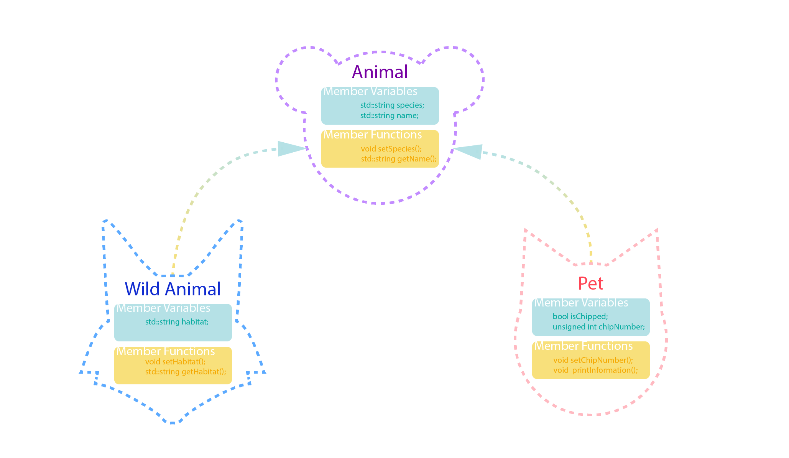

<!-- ---  
title: Creative Coding II
author: Angela Brennecke
affiliation: Film University Babelsberg KONRAD WOLF
date: Summer term 20
---   -->
**Creative Coding II**

Prof. Dr. Angela Brennecke | a.brennecke@filmuniversitaet.de | Film University Babelsberg *KONRAD WOLF*

---

**Table of Contents**
1. [Relationships in Object-Oriented Programming](#relationships-in-object-oriented-programming)
2. [Inheritance](#inheritance)
      1. [Inheritance and Access Levels](#inheritance-and-access-levels)
         1. [Public Access](#public-access)
         2. [Protected Access](#protected-access)
         3. [Private Access](#private-access)
3. [Inheritance and Specialization](#inheritance-and-specialization)
   1. [Inheritance and Object Construction](#inheritance-and-object-construction)
   2. [Polymorphism](#polymorphism)
   3. [Overriding Functions](#overriding-functions)
   4. [Virtual Functions](#virtual-functions)
4. [Design Aspects](#design-aspects)
   1. [Classes, Header, and Definition Files](#classes-header-and-definition-files)
5. [Bibliography](#bibliography)


--- 


# Relationships in Object-Oriented Programming 

A stable class interface that targets data encapsulation is usually determined by two aspects:
- A set of public access and manipulation functions that are independent of the underlying data types and structures
- A set of private data member variables and functions that define and manage the underlying data types and structures

Often times, the data member variables of a class are objects of user-defined class (types) themselves and thus object and class design often is determined by object-object relationships -- how do the objects relate to each other?

For example, the ofApp class is the main application object that gets created first and this object then initializes several objects that it contains in the form of member variables. The object-object relationship that is expressed here is referred to as **has-a** relationship or **composition**. 

**Composition**: *A body **has-a** heart*:
```cpp
class Heart {
public:
    Heart() { /* constructor code */ }
};

class Body {
private:
    Heart heart;
public:
    Body() : heart() { /* constructor code */ }
};
```

Another relationship that is very important is the **is-a** relationship which is referred to as **inheritance** and describes the process of inheriting and by this reusing features and functionality from a base class.

**Inheritance**: *A baseball **is-a** ball*
```cpp
class Ball {
public:
    Ball() { /* constructor code */ }
    void bounce() { /* bounce code */ }
};

class Baseball : public Ball {
public:
    Baseball() : Ball() { /* constructor code */ }
};
```

Cpp offers further relationship types such as **aggregation**, **association**, and **dependency** but we will stick with the main types above. Composition is already fairly familiar. Hence, let's move on to inheritance.

<!-- **Aggregation**: *A body **has-a** heart*:
```cpp
class Heart {
public:
    Heart() { /* constructor code */ }
};

class Body {
private:
    Heart* heart;
public:
    Body(Heart* h) : heart(h) { /* constructor code */ }
};

``` -->

<!-- 
**Association**: *A computer **uses-a** mouse*:
```cpp
class Mouse {
public:
    Mouse() { /* constructor code */ }
};

class Computer {
public:
    void useMouse(Mouse* mouse) {
        // Code to use the mouse
    }
};
```

**Dependency**: *A flower **depends-on** a bee for pollination*
```cpp
class Bee {
public:
    void pollinate() { /* pollination code */ }
};

class Flower {
public:
    void getPollinated(Bee& bee) {
        bee.pollinate();
    }
};
``` -->


# Inheritance

Inheritance models the **is-a** relationship between objects as illustrated in the following Diagram:


As you can see on the left, the shape class serves as base class from which more specific classes are inherited, all of them **being a** certain kind of shape. The same is true for the right side: The fruit class specifies the general features of a fruit, whatever this might be, and has two specific fruits inherit these features, i.e., apple and banana. In C++, inheritance is expressed by the use of the ":" following the base class that is being derived from. 

The following code examples illustrate a base class called "fruit" and its derived specialized fruit types/classes, i.e., "apple" and "banana":

```cpp
// base class fruit
class fruit
{
public:
    // constructors
    fruit();
    fruit(std::string theName);
    
    std::string printType();
    std::string printColor();
    std::string printMyOrigin();
    
protected:
    
    // Any member variable declared under protected access
    // can be used inside of this class as well as inside 
    // of any derived classes as well! These functions cannot
    // be access from outside of the classes or objects.
    std::string overseas();
    
private:
    
    std::string myName;
    std::string myColor;
};

```

```cpp
// Derived class apple
class apple : public fruit
{
public:
   
    apple();

    
private:
    
    std::string myColor;
};
```

```cpp
// Derived class banana
class banana : public fruit
{
public:
    
    banana(); // default constructor
    
private:
    // no private declarations yet
};
```
The children of fruit derive all functionality that has been specified in fruit and can access their parent's or base class functionality based on the access level definitions. 

### Inheritance and Access Levels

Derived classes can fully access all public member functions and data of their base classes. To further specify object hierarchies, the protected access level exists. Functionality defined under protected access can be accessed only from within the class itself and its children.

#### Public Access 

The derived classes inherit all functionality from the base class. However, the derived class can only access functionality specifed under **public**. 

In the following code example, the different functions of the fruit class hierarchy are drawn to the screen using ofApp's draw() function:

```cpp
void ofApp::draw(){

    fruit aSpecialFruit{"frutta_speciale_d\'_italia"}; 
    
    ofDrawBitmapString( aSpecialFruit.printType(), 20, 50);
    ofDrawBitmapString( aFruit.printType(), 20, 75);
    ofDrawBitmapString( anApple.printType(), 20, 100);
    ofDrawBitmapString( aBanana.printType(), 20, 125);
}
```

#### Protected Access 

All functions specified under **protected** can be used inside of the class where it is specified in as well as in any derived class just like any other function. The following code examples illustrate use of proteced access.

Inside of the fruit class, the function overseas() has been declared
under protected. It can be used within fruit class just like any 
other function:

```cpp
// Definition of overseas() function inside of fruit class:
std::string fruit::overseas() {

    return (".. I am from a land down under ..");
}

// Use of overseas() function inside of fruit class:
std::string fruit::printMyOrigin() {

    return ( "FRUIT's origin is " + overseas() );
}

```

Inside of the derived class *apple* we define a public function that 
accesses and uses the *derived* overseas() function:

```cpp
std::string apple::appleComesFrom() {
    
    // overseas() is declared as a protected function in the base class
    // consequently we can use it here.
    return (overseas() + ".. and that is italia");
}
```

The draw() function could now be extended as follows:

```cpp
void ofApp::draw(){

    fruit aSpecialFruit{"frutta_speciale_d\'_italia"}; 
    
    ofDrawBitmapString( aSpecialFruit.printType(), 20, 50);
    ofDrawBitmapString( aFruit.printType(), 20, 75);
    ofDrawBitmapString( anApple.printType(), 20, 100);
    ofDrawBitmapString( aBanana.printType(), 20, 125);

    ofDrawBitmapString( anApple.appleComesFrom(), 20, 175);
}
```

#### Private Access

Member variables declared as private can only be access from within the class / object that they were specified in.

# Inheritance and Specialization


While **object composition** creates new objects *by combining and connecting other objects*, **inheritance** creates new objects by directly **acquiring attributes and functionality of other objects and extending or specializing** them.

As such, inheritance typically models hierarchical relationships that **show a progression from general to specific**. In C++ we speak of a 
- **base class**
- **derived class**
  
The derived class inherits all attributes and functionality of its base class — without access to private base members. See the following Figure for an illustration:


*Copyright: Franziska Paetzold*

The *Animal* class is a base class that provides two public member variables and two member functions. All of them are inherited by the derived classes and can be used and accessed by the objects *Wild Animal* and *Pet*. In addition, the derived classes define their own specific member variables and functions which can only be used and accessed by themselves.

## Inheritance and Object Construction

In this context, an important aspect of inheritance is the sequence of construction:

- **The base class constructor will always be called prior to the derived class constructor!**

If not called explicitly by the derived class, the default constructor of the base class will be called. This can result in unexpected behavior which is why you should always explicitly call the base class constructor. For a detailed explanation, see this article:

- https://www.learncpp.com/cpp-tutorial/114-constructors-and-initialization-of-derived-classes/

## Polymorphism 

Polymorphism describes the capability to handle all objects of one class family intuitively by using a pointer of type base class: 

```cpp
#include "fruit.h"
#include "apple.h"
#include "banana.h"

int main()
{
    fruit aFruit;
    apple anApple;
    banana aBanana;

    fruit* aFruit = &anApple;
    aFruit->printName();

    aFruit = &banana;
    aFruit->printName();
    
    return 0;
}
```

This way, object families can be handled more easily. Pointers serve as a tool to **dynamically resolve** hierarchical object-object relationships. 


## Overriding Functions

Derived classes can also override functions that were specified in the base class, for example:

```cpp
// Derived class apple
class apple : public fruit
{
    
public:
   
    apple();

    void printColor();

    
private:
    
    std::string myColor;

};
```

```cpp
// In apple's cpp file, specify printColor in apple.
// by overriding fruit's printColor function.

void apple::printColor() {

    std::cout << "myColor is: " << myColor << std::endl;
}

```

In the ofApp draw() function, the pointer of type base class tries to resolve the function call.
```cpp
#include "fruit.h"
#include "apple.h"
#include "banana.h"

int main()
{
    fruit aFruit;
    apple anApple;

    fruit* aFruit = &anApple;
    aFruit->printName();        // !!! This will not print apple's color!!!
    
    return 0;
}
```

When the derived class overrides a base class function like in this example, **the pointer of type base class cannot resolve the specific function call** that belongs to the derived class. With the help of specifying a function as **virtual** the relationship can be resolved.

## Virtual Functions

By declaring a base class function as virtual, every function call will be resolved to the actual object the pointer of type base class is pointing to, see the following code example:

```cpp

// Derived class apple
class fruit
{
    
// ... 
    
protected: 
    // Specify the function to be virtual so that it can be resolved to the actual object
    virtual void printColor(); 
// ...
};
```

```cpp
// Derived class apple
class apple : public fruit
{
    
// ...
    
protected: 

    // Nothing needs to be changed in the derived class
    void printColor(); 
};
```

```cpp
#include "fruit.h"
#include "apple.h"
#include "banana.h"

int main()
{
    fruit aFruit;
    apple anApple;

    fruit* aFruit = &anApple;
    aFruit->printName();
    aFruit->printColor();   // Output as specified in apple, i.e., "my color is red"
    
    return 0;
}
```


The advantage is the you can handle all objects of a class hierarchy through their base type without losing the specific functionality of the derived classes. This is particularly useful when you have to manage several different objects. Hence, inheritance and polymorphism are very powerful concepts when designing classes and object relationships.

To dive deeper into the concepts of polymorphism and how they can enhance the management of objects in your code refer to
- http://www.cplusplus.com/doc/tutorial/polymorphism/


---

# Design Aspects

A rule of thumb for good class design is to ensure that  data members are *private* and can be accessed and manipulated by *public* function members. This way, a **solid public interface** can be designed which remains *as is* even when the underlying data members change. Additionally, this way any kind of manipulation of member variable values is restricted to the class only.

Object-oriented programming offers a way to group and encapsulate functionality and properties in individual objects. Central benefit of this approach is the reduction of complexity and the introduction of levels of abstractions to the code. All of the implementation details needed to implement the simple snake is moved to the object's class definition. In the main routine, i.e., in ofApp in our example, you only have to work with the snake object itself. This makes it easier to understand the code and supports the software design process.

Access levels are a C++ mechanism to support abstraction. 
In that regard, 
- The public keyword specifies the interface level of a class
- The protected keyword specifies the inheritance and hierarchical level
- The private keyword specifies the implementation details level, i.e., every 

## Classes, Header, and Definition Files

On a software design level, the [separation of header and definition files](http://www.cppforschool.com/tutorial/separate-header-and-implementation-files.html) clearly supports to distinguish between 

- **The what** - software interfaces, e.g., like class design and declarations, and
- **The how** - implementation details, e.g., like object instanciations and definitions in general.


Software interfaces describe **what** kind of functionality is available whereas implementation details describe **how** the functionality is implemented. It makes sense to separate both aspects, for example, when you think of OpenGL which provides a common software interface (API) and at the same time comes with different OpenGL implementations (OpenGL libraries/drivers) per platform and graphics card. The same is true in the context of the openFrameworks SDK.


--- 

# Bibliography


- [OOP Inheritance](https://openframeworks.cc/ofBook/chapters/OOPs!.html)
- [Polymorphism Tutorial](http://www.cplusplus.com/doc/tutorial/polymorphism/)

